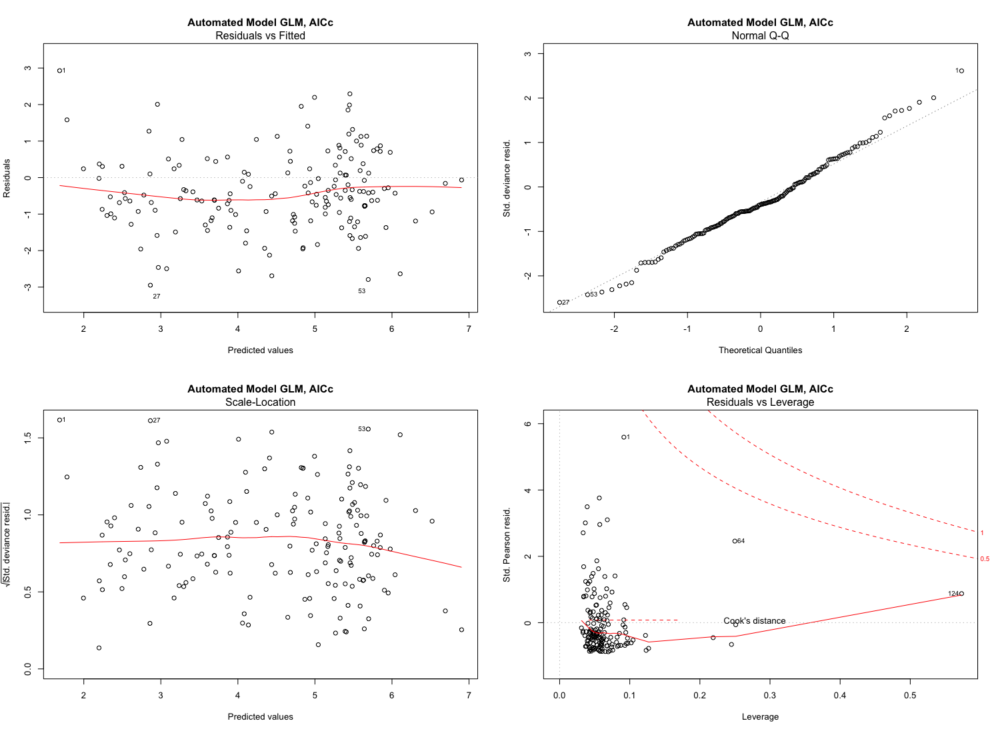
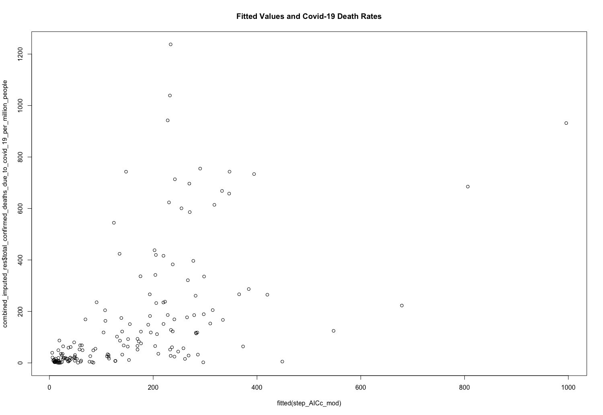

# GLM Models with Random Forest Imputation
## For "Full Model Imputation"

1. "junk" variables in each category was removed
2. categories were combined
3. imputed using random forest
4. removed other variables with poor interpretation
4. variables were iteratively removed till all had a VIF < 5
5. backwards selection was performed using AICc

Model Summary
```

                                                                                           Estimate  Pr(>|t|)    
(Intercept)                                                                               5.247e-01  0.42075    
prevalence_of_obesity_both_sexes_who_2019                                                 6.624e-02  7.01e-06 ***
life_satisfaction_in_cantril_ladder_world_happiness_report_2019                           3.386e-01  0.01575 *  
income_classification_world_bank_20172                                                    7.318e-01  0.02337 *  
income_classification_world_bank_20173                                                    1.077e+00  0.00689 ** 
income_classification_world_bank_20174                                                    6.951e-01  0.19476    
gdp_per_capita                                                                           -1.564e-05  0.04146 *  
income_support1                                                                           7.016e-01  0.00138 ** 
income_support2                                                                           6.050e-01  0.06727 .  
hospital_beds_per_1_000_population_oecd                                                  -6.866e-02  0.18570    
out_of_pocket_expenditure_per_capita_on_healthcare_ppp_usd_who_global_health_expenditure  9.923e-04  0.01238 *
```

Relevant diagnostic plots:


Plot of fitted values:
