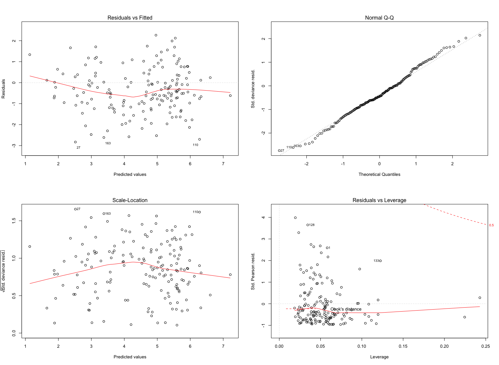
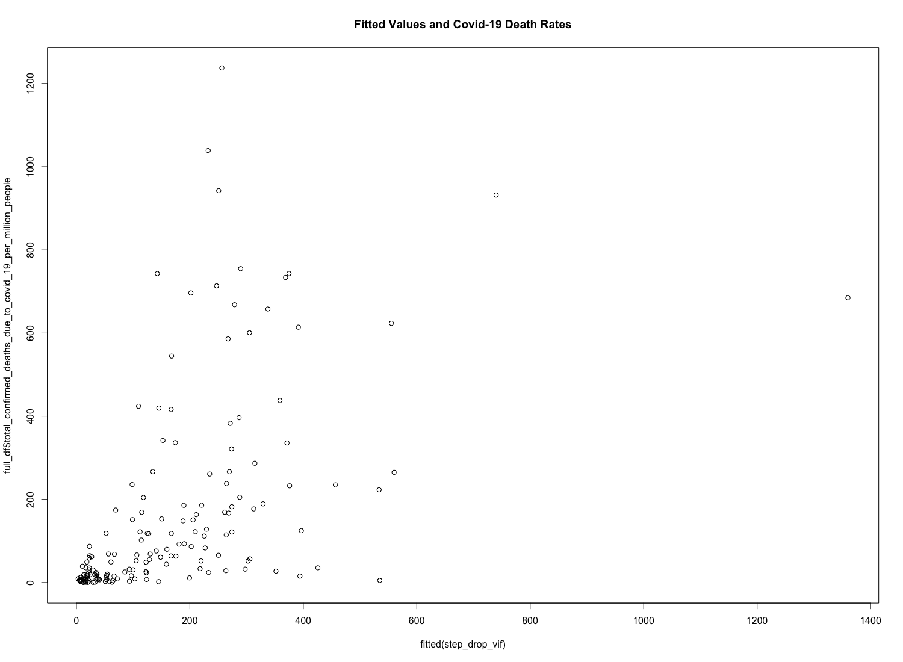
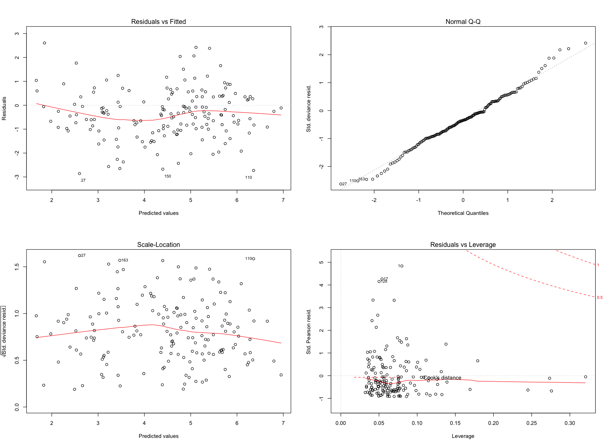
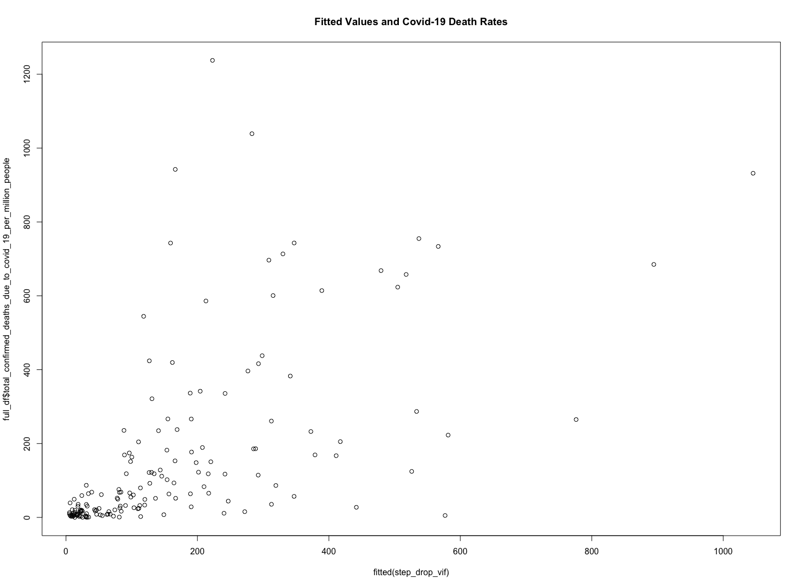

# GLM Models with Random Forest Imputation
## For "Full Model Imputation"

1. "junk" variables in each category was removed
2. categories were combined
3. imputed using random forest
4. removed other variables with poor interpretation
4. variables were iteratively removed till all had a VIF < 5
5. backwards selection was performed using AICc

Model Summary
```

                                                                                           Estimate  Pr(>|t|)    
(Intercept)                                                                               5.247e-01  0.42075    
prevalence_of_obesity_both_sexes_who_2019                                                 6.624e-02  7.01e-06 ***
life_satisfaction_in_cantril_ladder_world_happiness_report_2019                           3.386e-01  0.01575 *  
income_classification_world_bank_20172                                                    7.318e-01  0.02337 *  
income_classification_world_bank_20173                                                    1.077e+00  0.00689 ** 
income_classification_world_bank_20174                                                    6.951e-01  0.19476    
gdp_per_capita                                                                           -1.564e-05  0.04146 *  
income_support1                                                                           7.016e-01  0.00138 ** 
income_support2                                                                           6.050e-01  0.06727 .  
hospital_beds_per_1_000_population_oecd                                                  -6.866e-02  0.18570    
out_of_pocket_expenditure_per_capita_on_healthcare_ppp_usd_who_global_health_expenditure  9.923e-04  0.01238 *
```

Relevant diagnostic plots:


Plot of fitted values:


## For "Categories Imputed Model"
1. each category was imputed separately using random forest
2. variables with poor interpretation were removed
3. variables in each category were iteratively removed till all had a VIF < 5
4. backwards selection was performed using AICc in each category
5. this yielded a set of "significant variables" in each category
6. the imputed data for these variables were combined into a single dataframe
7. variables were iteratively removed till all had a VIF < 5
8. backwards selection was performed using AICc

Model Summary
```
                                                                                           Estimate  Pr(>|t|)    
(Intercept)                                                                               2.193e+00  0.00188 ** 
income_support1                                                                           6.224e-01  0.00197 ** 
income_support2                                                                          -4.282e-02  0.88762    
age_standardised_diabetes_prevalence_female                                              -8.684e-02  0.00558 ** 
prevalence_of_obesity_both_sexes_who_2019                                                 8.176e-02  4.46e-08 ***
gini_index                                                                                3.190e-02  0.00949 ** 
all_causes_disability_adjusted_life_years_who_2015                                       -2.029e-05  0.00123 ** 
physicians_per_1_000_population_oecd                                                      1.609e-01  0.00418 ** 
out_of_pocket_expenditure_per_capita_on_healthcare_ppp_usd_who_global_health_expenditure  5.519e-04  0.11486    

```

Relevant diagnostic plots:


Plot of fitted values:



## For "Categories Miss Model"
1. each category was imputed separately using random forest
2. variables with poor interpretation were removed
3. variables in each category were iteratively removed till all had a VIF < 5
4. backwards selection was performed using AICc in each category
5. this yielded a set of "significant variables" in each category
6. the data for these variables (before imputation) were combined into a single dataframe
7. data was imputed using random forest
8. variables were iteratively removed till all had a VIF < 5
9. backwards selection was performed using AICc

Model Summary
```
                                                                                           Estimate  Pr(>|t|)    
(Intercept)                                                                               5.097e+00  1.90e-09 ***
income_support1                                                                           5.358e-01  0.013036 *  
income_support2                                                                           2.910e-01  0.374284    
age_standardised_diabetes_prevalence_female                                              -1.347e-01  0.000239 ***
prevalence_of_obesity_both_sexes_who_2019                                                 8.202e-02  8.48e-07 ***
income_classification_world_bank_20172                                                    5.204e-01  0.112499    
income_classification_world_bank_20173                                                    7.293e-01  0.072952 .  
income_classification_world_bank_20174                                                    2.123e-01  0.665380    
all_causes_disability_adjusted_life_years_who_2015                                       -1.726e-05  0.014774 *  
nurses_per_1_000_population_oecd                                                         -7.578e-02  0.030762 *  
hospital_beds_per_1_000_population_oecd                                                  -1.573e-01  0.021940 *  
out_of_pocket_expenditure_per_capita_on_healthcare_ppp_usd_who_global_health_expenditure  9.490e-04  0.020243 *  

```

Relevant diagnostic plots:


Plot of fitted values:


## Variables in all 3 models
```
income_support
prevalence_of_obesity_both_sexes_who_2019
out_of_pocket_expenditure_per_capita_on_healthcare_ppp_usd_who_global_health_expenditure

```

## Variables in 2 models
```

age_standardised_diabetes_prevalence_female
income_classification
all_causes_disability_adjusted_life_years_who_2015
hospital_beds_per_1_000_population_oecd

```


