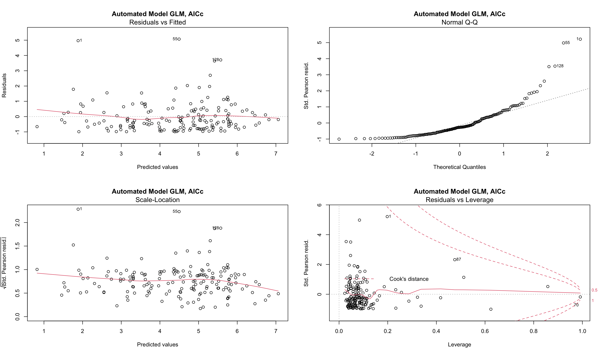
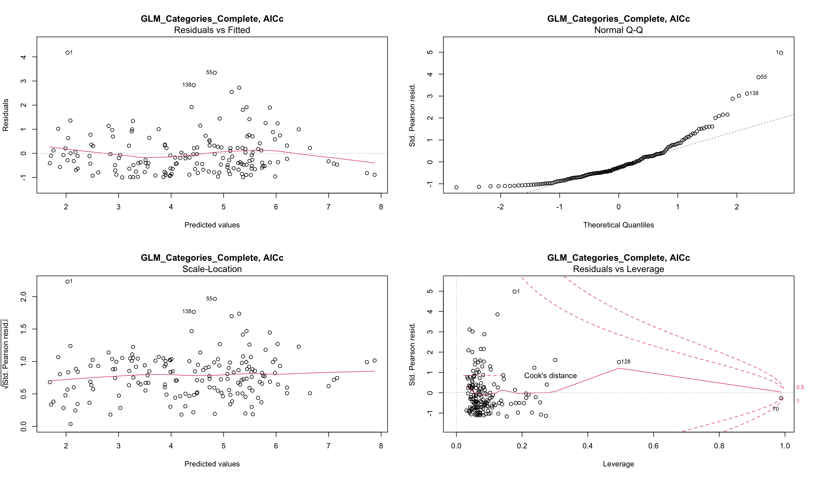
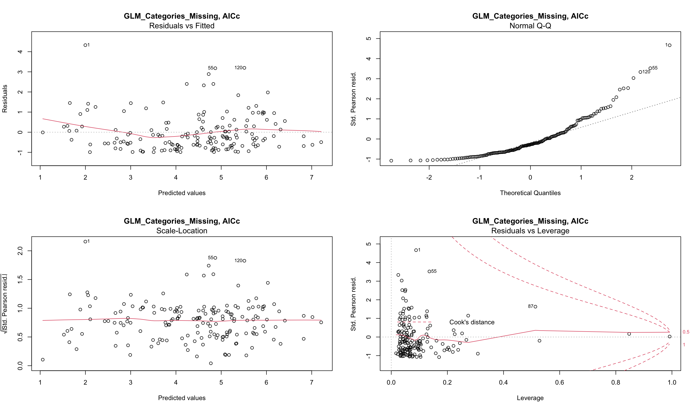

## For the "Automated GLM" model:

1. "junk" variables in each category was removed
2. categories were combined
3. imputed using random forest
4. variables were iteratively removed till all had a VIF < 5
5. backwards selection was performed using AICc

Model p-values:
```
cost_of_nutrient_adequate_diet_2017_usd_per_day                                          0.007493 ** 
cost_of_healthy_diet_2017_usd_per_day                                                    0.009670 ** 
nutrient_adequate_diet_cost_percent_of_average_food_expenditure                          0.004668 ** 
calorie_sufficient_diet_cost_number_cannot_afford                                        0.017571 *  
ratio_of_diabetes_to_overweight_prevalence                                               0.004694 ** 
deaths_no_access_to_handwashing_facility_sex_both_age_70_number                          0.018600 *  
cardiovascular_diseases_ihme_2017                                                        0.059791 .  
respiratory_disease_ihme_2017                                                            0.015012 *  
life_satisfaction_in_cantril_ladder_world_happiness_report_2019                          0.000278 ***
gini_index                                                                               0.115668    
income_support1                                                                          0.000224 ***
income_support2                                                                          0.050754 .  
beds_in_not_for_profit_privately_owned_hospitals_per_1_000_population_oecd               0.010859 *  
nurses_per_1_000_population_oecd                                                         0.005145 ** 
psychiatrists_per_1_000_population_oecd                                                  0.001559 ** 
out_of_pocket_expenditure_per_capita_on_healthcare_ppp_usd_who_global_health_expenditure 0.000568 ***
```

Relevant diagnostic plots:


## For the "GLM Categories Complete" model:
1. each category was imputed separately using random forest
2. variables in each category were iteratively removed till all had a VIF < 5
3. backwards selection was performed using AICc in each category
4. this yielded a set of "significant variables" in each category
5. the imputed data for these variables were combined into a single dataframe
6. variables were iteratively removed till all had a VIF < 5
7. backwards selection was performed using AICc

Model p-values:
```
nurses_per_1_000_population_oecd                                                         0.000646 ***
publicly_owned_hospitals_per_million_population_oecd                                     5.00e-05 ***
surgical_specialists_per_1_000_population_oecd                                           0.007632 ** 
out_of_pocket_expenditure_per_capita_on_healthcare_ppp_usd_who_global_health_expenditure 0.039330 *  
healthy_diet_cost_percent_of_1_20_poverty_line                                           0.001804 ** 
life_satisfaction_in_cantril_ladder_world_happiness_report_2019                          0.007307 ** 
ratio_of_diabetes_to_overweight_prevalence                                               6.95e-05 ***
deaths_no_access_to_handwashing_facility_sex_both_age_70_number                          0.067481 .  
kidney_disease_ihme_2017                                                                 0.000347 ***
meningitis_ihme_2017                                                                     4.86e-07 ***
income_support1                                                                          0.000846 ***
income_support2                                                                          0.040969 *  
debt_relief1                                                                             0.167931    
debt_relief2                                                                             0.124986    
gdp_growth_per_capita_from_previous_year_2020_q2                                         0.075864 .  
```
Relevant diagnostic plots:


## For the "GLM Categories Missing" model:
1. each category was imputed separately using random forest
2. variables in each category were iteratively removed till all had a VIF < 5
3. backwards selection was performed using AICc in each category
4. this yielded a set of "significant variables" in each category
5. the data for these variables (before imputation) were combined into a single dataframe
6. data was imputed using random forest
7. variables were iteratively removed till all had a VIF < 5
8. backwards selection was performed using AICc

Model p-values:
```
nurses_per_1_000_population_oecd                                                         0.044099 *  
publicly_owned_hospitals_per_million_population_oecd                                     0.002779 ** 
surgical_specialists_per_1_000_population_oecd                                           0.019816 *  
out_of_pocket_expenditure_per_capita_on_healthcare_ppp_usd_who_global_health_expenditure 0.005465 ** 
cost_of_nutrient_adequate_diet_2017_usd_per_day                                          0.012056 *  
healthy_diet_cost_percent_of_1_20_poverty_line                                           0.002693 ** 
nutrient_adequate_diet_cost_percent_of_average_food_expenditure                          0.076142 .  
calorie_sufficient_diet_cost_number_cannot_afford                                        0.030695 *  
ratio_of_diabetes_to_overweight_prevalence                                               1.58e-05 ***
deaths_no_access_to_handwashing_facility_sex_both_age_70_number                          0.051409 .  
meningitis_ihme_2017                                                                     0.000254 ***
income_support1                                                                          0.007645 ** 
income_support2                                                                          0.365965    
Mean.BMI..female.                                                                        0.053359 .  
gdp_growth_per_capita_from_previous_year_2020_q2                                         0.020546 * 
```


# Significant variables accross models
### Variables that are significant in all 3 models
```
ratio_of_diabetes_to_overweight_prevalence
deaths_no_access_to_handwashing_facility_sex_both_age_70_number
income_support
nurses_per_1_000_population_oecd
out_of_pocket_expenditure_per_capita_on_healthcare_ppp_usd_who_global_health_expenditure
```
### Variables that are significant in 2 models
```
cost_of_nutrient_adequate_diet_2017_usd_per_day
nutrient_adequate_diet_cost_percent_of_average_food_expenditure
calorie_sufficient_diet_cost_number_cannot_afford
life_satisfaction_in_cantril_ladder_world_happiness_report_2019
publicly_owned_hospitals_per_million_population_oecd
surgical_specialists_per_1_000_population_oecd
healthy_diet_cost_percent_of_1_20_poverty_line
meningitis_ihme_2017
gdp_growth_per_capita_from_previous_year_2020_q2
```
