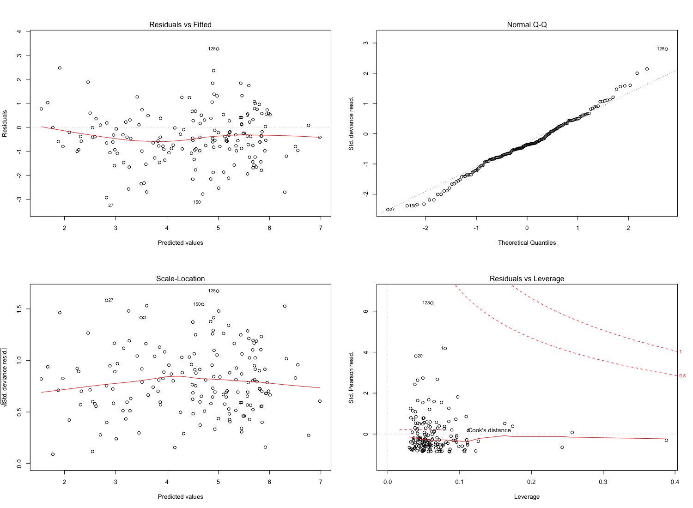

# GLM Models with MissForest Imputation
## For "Full Model Imputation"

1. "junk" variables in each category was removed
2. categories were combined
3. imputed using random forest
4. removed other variables with poor interpretation
4. variables were iteratively removed till all had a VIF < 5
5. backwards selection was performed using AICc

Model Summary
```
                                                                                           Estimate  Pr(>|t|)    
(Intercept)                                                                               2.182e+00  0.004226 ** 
population_with_access_to_improved_sanitation_y                                           2.162e-09  0.032484 *  
age_standardised_diabetes_prevalence_male                                                -9.137e-02  0.029768 *  
prevalence_of_obesity_both_sexes_who_2019                                                 8.000e-02  1.18e-06 ***
life_satisfaction_in_cantril_ladder_world_happiness_report_2019                           3.360e-01  0.009110 ** 
income_support1                                                                           8.032e-01  0.000337 ***
income_support2                                                                           3.072e-01  0.355133    
nurses_per_1_000_population_oecd                                                         -8.760e-02  0.017627 *  
out_of_pocket_expenditure_per_capita_on_healthcare_ppp_usd_who_global_health_expenditure  9.922e-04  0.010484 *  
```

Relevant diagnostic plots:


Plot of fitted values:


## For "Categories Imputed Model"
1. each category was imputed separately using random forest
2. variables with poor interpretation were removed
3. variables in each category were iteratively removed till all had a VIF < 5
4. backwards selection was performed using AICc in each category
5. this yielded a set of "significant variables" in each category
6. the imputed data for these variables were combined into a single dataframe
7. variables were iteratively removed till all had a VIF < 5
8. backwards selection was performed using AICc

Model Summary
```
                                                                                          Estimate  Pr(>|t|)    
(Intercept)                                                                               3.833e+00   1.35e-07 ***
income_support1                                                                           7.711e-01   0.000622 ***
income_support2                                                                          -2.203e-03   0.994208    
prevalence_of_obesity_both_sexes_who_2019                                                 3.856e-02   0.004570 ** 
income_classification_world_bank_20172                                                    7.548e-01   0.022817 *  
income_classification_world_bank_20173                                                    1.004e+00   0.019919 *  
income_classification_world_bank_20174                                                    1.131e+00   0.030142 *  
healthy_diet_cost_percent_cannot_afford                                                  -1.220e-02   0.007572 ** 
all_causes_disability_adjusted_life_years_who_2015                                       -1.194e-05   0.107682    
hospital_beds_per_1_000_population_oecd                                                  -1.700e-01   0.023522 *  
out_of_pocket_expenditure_per_capita_on_healthcare_ppp_usd_who_global_health_expenditure  8.379e-04   0.027431 *   
```

Relevant diagnostic plots:


Plot of fitted values:


## For "Categories Miss Model"
1. each category was imputed separately using random forest
2. variables with poor interpretation were removed
3. variables in each category were iteratively removed till all had a VIF < 5
4. backwards selection was performed using AICc in each category
5. this yielded a set of "significant variables" in each category
6. the data for these variables (before imputation) were combined into a single dataframe
7. data was imputed using random forest
8. variables were iteratively removed till all had a VIF < 5
9. backwards selection was performed using AICc

Model Summary
```
                                                                                            Estimate Pr(>|t|)    
(Intercept)                                                                               3.788e+00  1.32e-06 ***
income_support1                                                                           5.895e-01  0.01401 *  
income_support2                                                                          -1.141e-01  0.72241    
age_standardised_diabetes_prevalence_female                                              -9.973e-02  0.00655 ** 
prevalence_of_obesity_both_sexes_who_2019                                                 7.359e-02  3.12e-05 ***
income_classification_world_bank_20172                                                    7.141e-01  0.04321 *  
income_classification_world_bank_20173                                                    1.127e+00  0.01029 *  
income_classification_world_bank_20174                                                    7.209e-01  0.18036    
death_rates_from_all_air_pollution_per_100_000                                            4.827e-03  0.12545    
all_causes_disability_adjusted_life_years_who_2015                                       -1.706e-05  0.02554 *  
hospital_beds_per_1_000_population_oecd                                                  -2.024e-01  0.02979 *  
out_of_pocket_expenditure_per_capita_on_healthcare_ppp_usd_who_global_health_expenditure  7.294e-04  0.07848 .  
```

Relevant diagnostic plots:


Plot of fitted values:


## Variables in all 3 models
```
income_support
prevalence_of_obesity_both_sexes_who_2019
out_of_pocket_expenditure_per_capita_on_healthcare_ppp_usd_who_global_health_expenditure
```

## Variables in 2 models
```
age_standardised_diabetes_prevalence_male/age_standardised_diabetes_prevalence_female
income_classification_world_bank_2017
all_causes_disability_adjusted_life_years_who_2015
hospital_beds_per_1_000_population_oecd
```